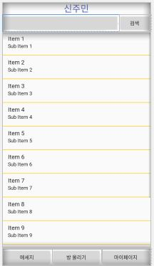
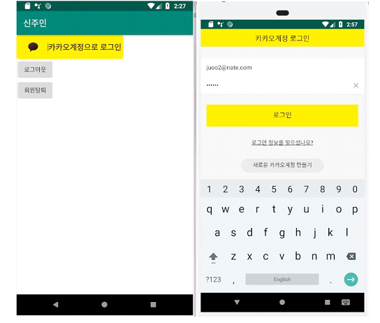
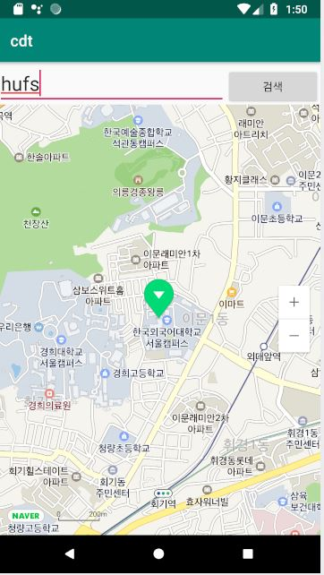
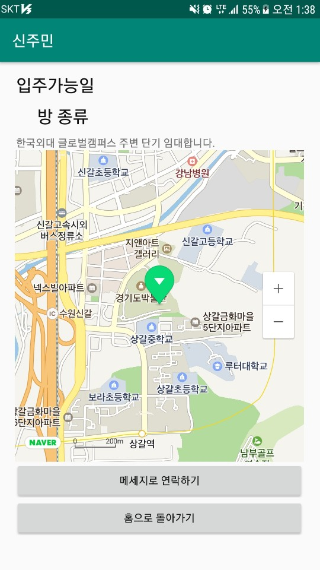

# cdt 신주민 앱

### 2019 한국외대 종합설계 4팀 CDT
- 이태규,깃헙 아이디: bryan9512 (팀장): Android 총괄 개발, firebase realtime DB 활용 게시글 posting, 검색, 내가 쓴 글 보기
- 류권환,깃헙 아이디: juoo2 (팀원): Kakao Login API활용 Login기능, Naver Maps API 활용 게시글 위치 확인, 게시글 작성 시 정확한 주소를 위한 지번주소, 도로명주소, 위도, 경도
- 윤혜선,깃헙 아이디: xhtlfdl93999 (팀원): Android 클라이언트 기능 및 UI 제작 게시글 권한 API 를 이용한 사진 등록
- 박혜림,깃헙 아이디: gpfla201 (팀원): Android 클라이언트 기능 및 UI 제작 FirebaseDB 를 이용한 Chat기능

## 신주민 - NaverMaps API를 활용한 중,단기 임대차 매칭 서비스

### 개요

- 중,단기 임대차 서비스에 대한 수요 증가
- AirBNB에서 겨냥하지 않는 중,단기 임대차에 대한 서비스 제공
- 주소, 방 종류(원룸, 투룸) 등에 대해 맞춤 검색 

## 2019년 4월 29일
- LIST VIEW 완성

## 2019년 4월 30일
- 사업계획서, 요구사항 정의서 추가

- 리스트뷰

## 2019년 5월 13일
- 카카오로그인 완료

-네이버 Maps 완료

## 2019년 5월 19일
- 메세지 database 연동

## 2019년 5월 20일
- 사진 불러오기 성공
- 게시글 DB저장 성공

## 2019년 5월 21일
- 상세설계서, 중간발표 ppt 추가

## 2019년 6월 1일 
- 도로명, 지번 주소 불러오기 성공
- 리스트뷰 정보 제공 가능

## 2019년 6월 2일
- 상세 글 보기 가능
- 글 검색 기능

## 2019년 6월 3일
- 상세 글 지도 탑제
- 내가 쓴 글 기능
- 리스트뷰 오류 수정

## 2019년 6월 10일
- UI 수정완료
- 이미지 업로드, 다운로드 기능 완료
- 다운로드 실패시 디폴트 이미지 지정 완료
- 매칭 시스템 개발 완료
